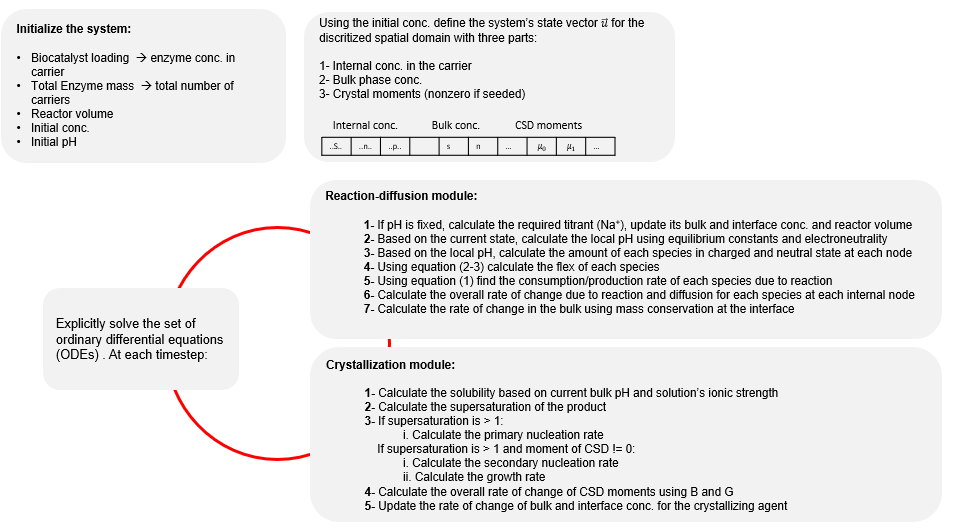

# Rxn-Dif-Cry
A MATLAB project for modeling coupled reaction, diffusion, and crystallization processes in a biocatalytic reactive crystallization process.

Main.m defines intial parameters including vessel pH, total enzyme concentration, etc. It calls on rate_calc.m that calculates the derivative of each state in the system by using Crystal.m and RxnDiffusion.m to calculate the rate of crystallization and reaction at each instance in time. Csat.m and pH_help.m support the Crystal.m to cacluate the birth and growth terms in the population balance expressions.

Overall model framework:

Project was developed for the work: "Model development for enzymatic reactive crystallization of β-lactam antibiotics: a reaction–diffusion-crystallization approach"
https://pubs.rsc.org/en/content/articlelanding/2020/re/d0re00276c/unauth

Example output showing the crystal formation rate as a function of vessels pH in a batch process:

